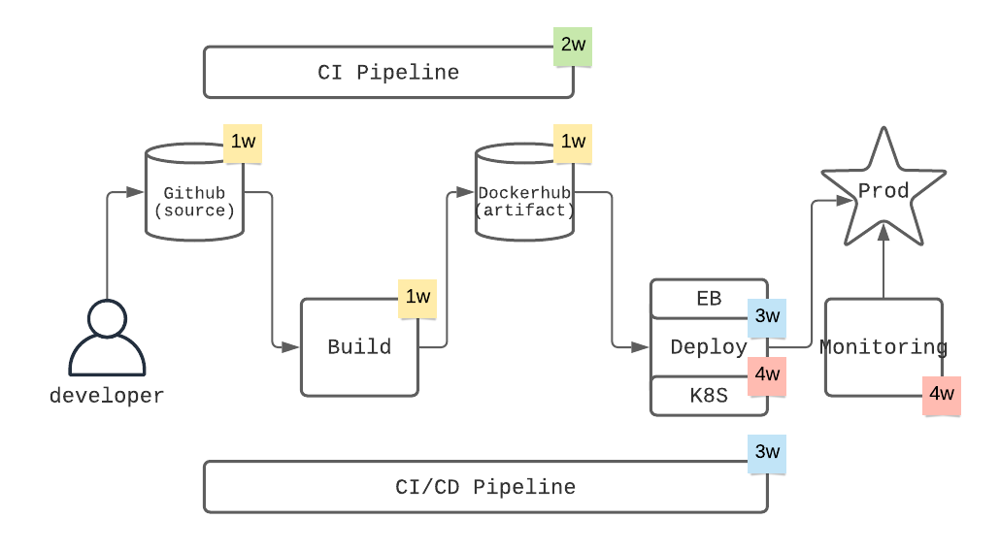

# Devops CICD Workshop

이 코드 레포는 데브옵스 워크샵 특히 CI/CD 관련 실습 코드, 가이드 문서 등으로 구성 되어 있습니다. 보다 자세한 워크샵의 정보 혹은 실습 멘토링이 필요할 경우 <a href="mailto:cloudacode@gmail.com">cloudacode@gmail.com</a>로 연락 주세요.

* 블로그: https://medium.com/@cloudacode
* 팟케스트: http://www.podbbang.com/ch/1779436

## 시작하기
빌드 자동화 실습을 위해 맨 상위 디렉토리에 Dockerfile, Python Flask app, Python requirements 파일 그리고 CodeBuild용 buildspec 설정 파일이 작성되어 있습니다.
AWS 환경을 기준으로 실습이 가이드가 작성 있으며 구성 방법에 대해서는 각 Week별로 디렉토리의 README에 정리가 되어 있습니다. 

## 주의사항
본 레포지토리의 소스코드는 테스트, 실습, 데모용으로 작성 되어 있으며 상용 환경의 책임을 지지 않습니다.

## 라이센스
모든 코드들은 MIT 라이센스를 따르고 있습니다. LICENSE.txt를 참조 하십시오.