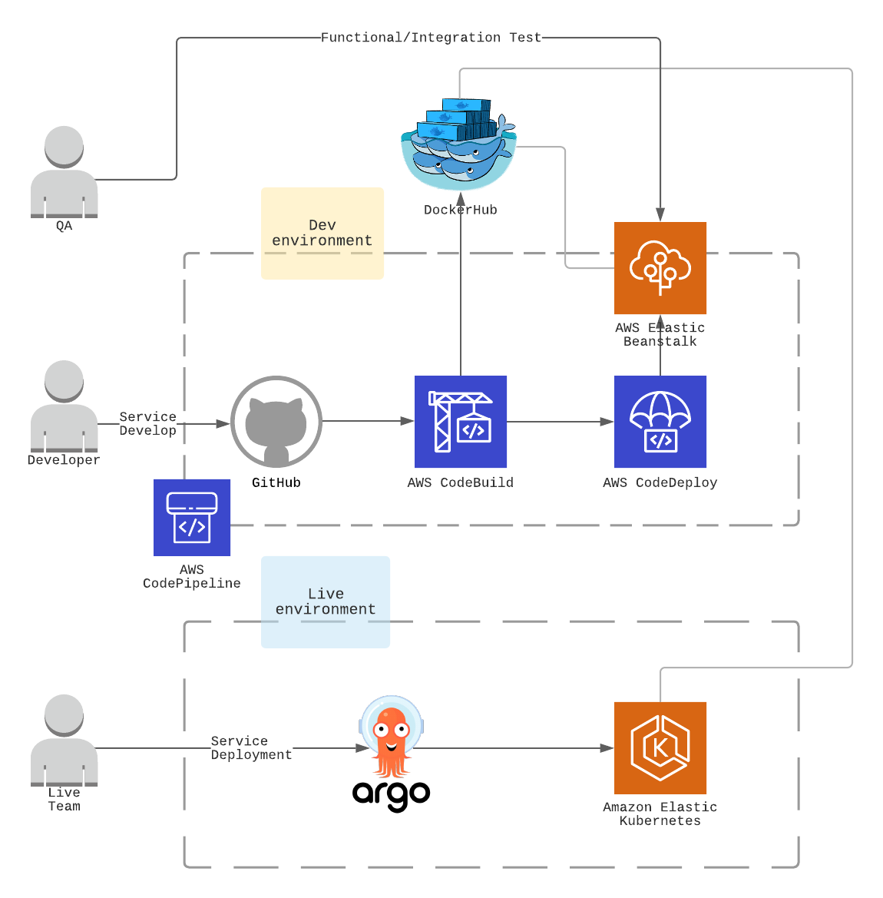

# DevOps - EKS with ArgoCD Pipeline

__EKS로 라이브 환경 구성 및 배포 환경 자동화 실습__

코드 빌드 및 테스트 환경을 구축 하였다면 이제 EKS로 상용 환경을 만들고 배포 관리툴(ArgoCD)을 설치해 관리 콘솔로 유연하게 서비스를 배포, 관리 효율화 

## 사전 준비 사항
[CI Integration](../aws-codepipeline-eb/README.md)

### Create a IAM user for EKS
EKS는 Root User로 생성/접속하는 것을 보안상 권고하지 않으며 EKS을 관리하기 위한 권한(Kubernetes RBAC authorization)을 EKS를 생성한 IAM 엔터티(user 혹은 role)로 부터 할당을 시키기 때문에 IAM user 혹은 role를 사용중이지 않다면 필수로 IAM 엔터티를 생성하고 EKS 생성 역할을 부여 해야한다. 

> **_Important:_** 
When an Amazon EKS cluster is created, the IAM entity (user or role) that creates the cluster is added to the Kubernetes RBAC authorization table as the administrator (with system:masters permissions). Initially, only that IAM user can make calls to the Kubernetes API server using kubectl. For more information, see Managing users or IAM roles for your cluster. If you use the console to create the cluster, you must ensure that the same IAM user credentials are in the AWS SDK credential chain when you are running kubectl commands on your cluster.
https://docs.aws.amazon.com/eks/latest/userguide/create-cluster.html

[Stackoverflow: only-the-creator-user-can-manage-aws-kubernetes-cluster-eks-from-kubectl](https://stackoverflow.com/questions/55308605/only-the-creator-user-can-manage-aws-kubernetes-cluster-eks-from-kubectl#:~:text=When%20an%20Amazon%20EKS%20cluster,Kubernetes%20API%20server%20using%20kubectl.)

사용중인 IAM 엔터티가 있다면 eksctl 권한이 있는지 검토. 원활한 실습을 위해 **AdministratorAccess** policy 부여

Otherwise, create a IAM user with eksctl minimum policies.
https://eksctl.io/usage/minimum-iam-policies/

추후 eksctl CLI활용을 위해 access key, secret key 발급(보안 자격 증명 -> 엑세스 키) 및 aws cli에 credential 등록

aws cli 설치: [관련 링크](https://docs.aws.amazon.com/cli/latest/userguide/install-cliv2.html)

aws configure 초기 설정: [관련 링크](https://docs.aws.amazon.com/cli/latest/userguide/cli-configure-quickstart.html)

IAM 엔터티가 잘 적용 됬는지 확인
```bash
$ aws sts get-caller-identity
```

### Install eksctl and kubectl

EKS 생성을 위해 eksctl을 설치 하고 추후 kubernetes 관리를 위해 kubectl도 사전에 설치 필요: [설치 관련 링크](https://docs.aws.amazon.com/eks/latest/userguide/getting-started-eksctl.html)

## 구성 하기


### Deploy EKS Cluster

EKS 환경 배포
(참고: 실습 비용 절감을 위해 SPOT 인스턴스 사용)

```
$ eksctl create cluster -f ./eks-cluster-config.yml
```
약 K8S Cluster 구성까지 15분 소요

만약 CLI로 하고 싶다면 다음과 같이 수행
```
eksctl create cluster \
--name devops-eks-01 \
--version 1.18 \
--region ap-northeast-2 \
--nodegroup-name linux-nodes \
--nodes 1 \
--nodes-min 1 \
--nodes-max 3 \
--with-oidc \
--ssh-access \
--ssh-public-key kc-seoul-devops \
--managed \
--alb-ingress-access \
--spot \
--instance-types=c4.large,c5.large
```

### EKS Cluster 접속 확인

정상적인 output
```
[✔]  all EKS cluster resources for "devops-eks-01" have been created
[ℹ]  nodegroup "devops-eks-workers" has 1 node(s)
[ℹ]  node "ip-192-168-27-236.ap-northeast-2.compute.internal" is ready
[ℹ]  waiting for at least 1 node(s) to become ready in "devops-eks-workers"
[ℹ]  nodegroup "devops-eks-workers" has 1 node(s)
[ℹ]  node "ip-192-168-27-236.ap-northeast-2.compute.internal" is ready
[ℹ]  kubectl command should work with "/Users/kcchang/.kube/config", try 'kubectl get nodes'
[✔]  EKS cluster "devops-eks-01" in "ap-northeast-2" region is ready
```

kubectl을 통해 추가된 node 확인
```
➜  ✗ kubectl get nodes
NAME                                                STATUS   ROLES    AGE   VERSION
ip-192-168-27-236.ap-northeast-2.compute.internal   Ready    <none>   19m   v1.18.9-eks-d1db3c
```

## ArgoCD 연동

### ArgoCD CLI 설치
https://argoproj.github.io/argo-cd/cli_installation/

### ArgoCD 설치
https://argoproj.github.io/argo-cd/getting_started/

### ArgoCD를 통해 App 배포
https://argoproj.github.io/argo-cd/getting_started/#6-create-an-application-from-a-git-repository

## Trobleshooting

https://aws.amazon.com/premiumsupport/knowledge-center/amazon-eks-cluster-access/

