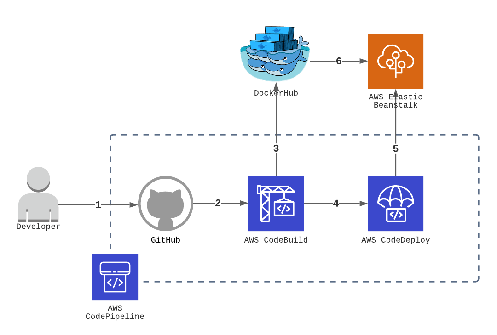

# DevOps - CICD Pipeline 실습

__개발 빌드/배포 환경 자동화 실습__

CI/CD Pipeline 도구를 통해 소스 관리, 도커 빌드 자동화, 서비스 배포 까지 자동화

## 사전 준비 사항
[CI Integration](../github-aws-codebuild-dockerhub/README.md)

## 구성 하기


### Setup ElasticBeanstalk

https://ap-northeast-2.console.aws.amazon.com/elasticbeanstalk/home?region=ap-northeast-2#/welcome

#### Create Application(Create a Web app)

1. Application Name
2. Platform: Docker, Platform Branch: Docker running...Amazon Linux 2, Platform version: Recommended
3. Application Code: Sample application

EB(ElasticBeanstalk) app 생성 확인까지 약 5분 소요

### Setup codepipeline

https://ap-northeast-2.console.aws.amazon.com/codesuite/codepipeline/pipelines

#### Step 1: Pipeline settings
1. Pipeline Name
2. Service Role: New Service Role
3. Role Name: `AWSCodePipelineServiceRole-ap-northeast-2-[Pipeline Name]`
   - AWS CodePipeline이 이 새 파이프라인에 사용할 서비스 역할을 생성하도록 허용 활성화
  
#### Step 2: Source Stage
1. 소스: Github(Version 1), 내 GitHub 계정의 리포지토리
   - Github v2가 권고 사항이나 실습은 v1로 진행: [v2 변경시 참고](https://docs.aws.amazon.com/ko_kr/codepipeline/latest/userguide/update-github-action-connections.html)
2. Repository, Branch: 본인의 Repo, 원하는 Branch name e.g., main, dev, release
3. Detection option: GitHub Webhook(recommended)

#### Step 3: Build Stage
1. Provider: AWS Codebuild
2. Project Name: Create Project
3. 환경: 관리형 이미지, Ubuntu, Standard, aws/codebuild/standard:4.0, 권한 승격 활성화
4. 서비스 역할: 새 서비스 역할 (프로젝트 생성 후 IAM에서 추후 업데이트)
5. 환경 변수:
   ```
   IMAGE_TAG: latest
   IMAGE_REPO_NAME: [Docker Repo Name]
   DOCKERHUB_USER: dockerhub:username
   DOCKERHUB_PW: dockerhub:password
   ```
   - [앞 실습](../github-aws-codebuild-dockerhub/README.md#setup-the-codebuild)과 같이 username, password는 Secret Manager
6. Buildspec: buildspec 파일 사용, Buildspec name: buildspec_eb.yml    
7. 배치 구성, 로그: Default

#### Step 4: Deploy Stage
1. Provider: AWS Elastic Beanstalk
2. Application Name, Environment Name: 위에서 자동 생성한 [EB 정보](#create-applicationcreate-a-web-app)

구성 완료후 [앞 실습](../github-aws-codebuild-dockerhub/README.md#add-permission-in-iam-role)과 동일하게 IAM에 권한 부여

### 테스트 Pull Request/Merge 

별도의 Branch를 만들어 app.py의 Hello World 리턴값 변경 후 main으로 PR 수행 후 이상 없으면 Main에 Merge.

https://ap-northeast-2.console.aws.amazon.com/codesuite/codepipeline/pipelines

Pipeline 도구가 변경 사항을 인지하여 자동으로 빌드/배포가 수행 되는지 확인

### ElasticBeanstalk 환경 URL 확인 

EB의 애플리케이션 [환경 URL](#create-applicationcreate-a-web-app) 확인 후 정상적으로 웹페이지에 변경이 일어났는지 확인

https://ap-northeast-2.console.aws.amazon.com/elasticbeanstalk/home?region=ap-northeast-2#/environments


## 참고 자료

- https://docs.aws.amazon.com/elasticbeanstalk/latest/dg/single-container-docker-configuration.html#docker-configuration.no-compose
- https://d1.awsstatic.com/whitepapers/DevOps/practicing-continuous-integration-continuous-delivery-on-AWS.pdf
- https://docs.aws.amazon.com/codebuild/latest/userguide/sample-elastic-beanstalk.html#sample-elastic-beanstalk-codepipeline
- https://docs.aws.amazon.com/ko_kr/codepipeline/latest/userguide/tutorials-four-stage-pipeline.html#tutorials-four-stage-pipeline-prerequisites-jenkins-configure