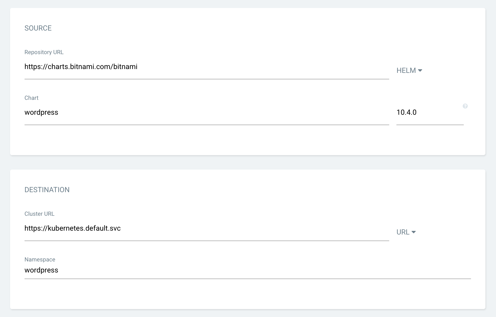

# DevOps - Monitoring

__Prometheus Grafana Moniting__

K8S 환경과 같은 분산형 클라우드 환경에서 서비스를 운영 하기 위해서는 모니터링이 필수 요소이며 Prometheus, Grafana를 통해 서비스 모니티링 수행 


Credit: https://sysdig.com/blog/kubernetes-monitoring-prometheus/

## 사전 준비 사항

### EKS Cluster 환경
[eks cluster 환경 구축](../amazon-eks-argocd/README.md)

### Helm CLI 설치
https://docs.aws.amazon.com/ko_kr/eks/latest/userguide/helm.html

### (option) Deploy wordpress helm chart via ArgoCD
https://helm.sh/docs/topics/chart_tests/

- Enable `AUTO-CREATE NAMESPACE`
- SOURCE
  - Repository URL: `https://charts.bitnami.com/bitnami` 
  - Type: `HELM`
  - Chart: `wordpress`
  - Version: `10.4.0`
- DESTINATION
  - Cluster URL: https://kubernetes.default.svc
  - Namespace: wordpress



배포 후 SVC 상세 정보를 통해 Endpoint 접속


## 1. EKS에 Prometheus 설치

### Prometheus Helm Repo 등록 
```
helm repo add prometheus-community https://prometheus-community.github.io/helm-charts
helm repo update
```

https://github.com/prometheus-community/helm-charts

### Prometheus 설치(Helm 사용)
```
kubectl create namespace prometheus

helm install prometheus prometheus-community/prometheus \
    --namespace prometheus \
    --set alertmanager.persistentVolume.storageClass="gp2",server.persistentVolume.storageClass="gp2"
```

https://docs.aws.amazon.com/eks/latest/userguide/prometheus.html

## 2. EKS에 Grafana 설치 및 Prometheus 연동

### Grafana Helm Repo 등록

```
helm repo add grafana https://grafana.github.io/helm-charts
helm repo update
```
https://github.com/grafana/helm-charts/tree/main/charts/grafana

### Grafana 설치(Helm 사용)

```
kubectl create namespace grafana

helm install grafana grafana/grafana \
    --namespace grafana \
    --set persistence.storageClassName="gp2" \
    --set persistence.enabled=true \
    --set adminPassword='DevOps1@' \
    --values grafana.yaml \
    --set service.type=LoadBalancer
```

### LB Endpoint for Grafana
```
kubectl get svc -n grafana grafana -o jsonpath='{.status.loadBalancer.ingress[0].hostname}'
```

## 3. Monitoring Dashboard 구성  

왼쪽 텝 __+__ Import -> Upload Json File:
`kubernetes-cluster-prometheus_rev1.json` 업로드

Options
  - prometheus: `Promethesus`

아래처럼 리소스에 대한 모니터링 대쉬보드 확인


### 5. Clean up

```
helm uninstall prometheus --namespace prometheus
kubectl delete ns prometheus

helm uninstall grafana --namespace grafana
kubectl delete ns grafana
```